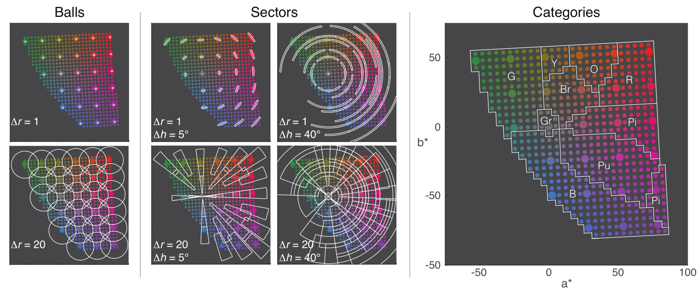
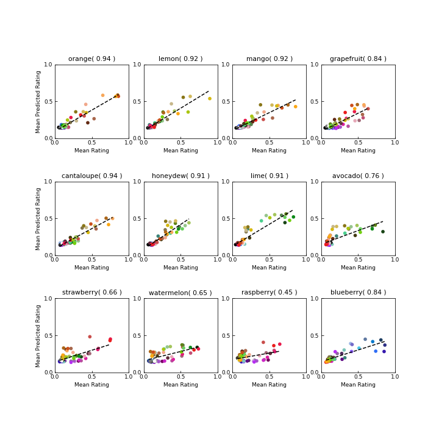

# Estimating color-concept associations from image statistics

In this study, we developed a new approach for estimating color-concept associations. Building on prior studies that used images downloaded from Google Images, we provide new insights into effectively estimating distributions of human color-concept associations across CIELAB color space. Specifically, we evaluated several methods for filtering the raw pixel content of the images in order to best predict color-concept associations obtained from human ratings. The most effective method extracted colors using a combination of cylindrical sectors in color space and color categories.  


We demonstrate that our approach can accurately predict average human color-concept associations for different fruits using only a small set of images.

This repo consists of the image dataset, jupyter notebooks, matlab scripts and data files required to predict the color-concept associations using the cylindrical sectors and color categories as features. This repo also contains additional notebooks used for analysis.

## Dependencies
- [Python package](https://google-images-download.readthedocs.io/en/latest/index.html) for downloading Google images for a set of concepts. [(Link to Github Repo)](https://github.com/hardikvasa/google-images-download)    
``` $ pip install google_images_download ```
- [Jupyter notebook](https://jupyter.org/install) All Python code is written in Jupyter notebooks.  
- [Scikit-Image](https://scikit-image.org/download.html) for image processing in Python.  
``` $ conda install -c conda-forge scikit-image ```
- [MATLAB Engine API for Python](https://www.mathworks.com/help/matlab/matlab_external/install-the-matlab-engine-for-python.html)
- [Color Categorization](https://github.com/ArashAkbarinia/ColourCategorisation)
module for classifying each pixel as one of the focal color names.    

## Usability
The repo can be used and replicated in two different scenarios:
1. To reproduce the research study to predict color-concept associations of our fruit concepts using our trained fruit model described in the paper.
2. To predict color-concept associations of new concepts with new set of test images and colors using our trained model.

## Input Files and Directories
- ##### Downloads
  Folder containing the image dataset with specific type of image like 'top', 'cartoon' and 'photo'. Inside these folders should be the folders containing the specific concept images.
- ##### LAB.csv
  A csv file of color coordinates in LAB space.
- ##### RGB.csv
  A csv file of color coordinates in RGB space.
- ##### Category.csv
  A csv file of the color category of chosen colors.
- ##### data_clean.csv
  A csv file containing the true color-concept association ratings from humans.
- ##### TestScripts
  Folder containing the input color data, human ratings and supporting MATLAB scripts of the test concepts of our study.

## Output
The output of this study is the predicted color-concept association ratings which can be further used to assign visually separable and semantic colors to different concepts. One of the sample predicted ratings can be seen in ```Exp1_ErrCorrFrom3ModelsTOP50.ipynb```

- The ratings of all the fruit concepts w.r.t every UW-58 color from Exp 1, Exp 2 and the Lin et al method along with the true human color-concept association ratings obtained from 55 participants is in the ```RatingsAllMethods.csv``` file.  

- The ratings of all the test concepts w.r.t every BCP-37 color from Exp3 is in the ```RatingsTestConcepts.csv``` file.

## Implementation

### To replicate the research study:
1. Download the entire repository or clone it to your own github.  

2. The entire image dataset is in the ```downloads``` folder and most data files are present as csv and excel spreadsheets in the downloaded repo. To replicate the study, you need not run code to get these data files.
This step will involve running code if you wish to get features for new concepts. We extract features from the given set of images in this step.  
 **Notebooks with title ```getFeatures_*``` can be referenced to see how features are extracted.**

##### Exp 1A, 1B and 1C (For top 50 images of concepts obtained from Google)
3. Detailed analysis of the number of features to be used for three models and what those features should be, from an array of features obtained from top 50 images, are in the jupyter notebooks ```AnalysisI``` (Ball), ```AnalysisII``` (Sector) and ```AnalysisIII```( Sector + Category). This analysis includes which features are important to a specific model.

4. Using the specific features obtained from step 3, the predictions using Linear Regression are obtained in notebooks with title ```Exp1_ErrCorrFrom3ModelsTOP50.ipynb```. These notebooks use the four chosen features from the previously step 3. notebooks and determine how the predicted ratings differ from the actual ratings using squared error and correlation.  
  **Here, we also conclude that using 'Sector+Category' features best fit the prediction model. Table 1 in the paper describes the specific values used for selected features**  

##### Exp 2: Prediction models with different image types

To test the hypothesis that a model that accurately estimates humanlike color-concept association ratings will perform as well for natural images as it does for humanmade illustrations, we tested two new image sets for each fruit,
one of photographs and one of cartoons.

5. The extracted features for both 'Cartoon' and 'Photo' images are available as ```dataCartoon50.xlsx``` and ```dataPhoto50.xlsx```. The notebook ```AnalysisWithImageType.ipynb``` contains the analysis for both the image types.

6. Color-concept estimates from all the three models *photo* and *cartoon* image types can be seen in ```Exp2_Exp2_ErrCorrFrom3ModelsCARTOON50``` and ```Exp2_Exp2_ErrCorrFrom3ModelsPHOTO50```.

##### Exp 3: Prediction of color-concept association ratings of new test concepts using the trained model

7. The new test concepts were paper, plastic, glass, metal, compost and trash. BCP-37 colors were used for this experiment. The notebook ```Exp3_testConcepts.ipynb``` can be referred for the output. The test data files are under **'TestScripts'** folder.

**_The path to the saved project must be changed in all the notebooks._**


### To test new concepts and new colors:
Our trained model can be tested on new concepts and  new colors without the need to gather any new human ratings. The concept is queried in Google Images, the four chosen features are extracted from the images for the desired colors, and the trained model weights are applied to the features to obtain the predictions. The steps are:

1. Creating the input dataset.
  - If the concepts are to be associated with newer set of colors, it is important to get the categories of those colors using ```createDataCSV.m```. This script takes ColorObjAssocLoad.mat file for true color-concept association ratings (**optional**) and an excel spreadsheet of color coordinates. If the color coordinates are not provided, the data files for either BCP-37 or UW-58 colors can be used.
  The current version uses xyY coordinate space, but RGB/Lab coordinate space can also be used. Refer to [colorconvert](https://github.com/LaurentLessard/colorconvert) to convert from one color coordinate space into another. This script file will create all data files under the TestScripts folder. **Modify the test script if needed.**
  
2.  Using the notebook ```Exp3_testConcepts.ipynb```, extract the features required from the new images and follow code from the notebook to get the predicted color-concept associations. Make changes as and when necessary.


## Scatter plots for concepts (with correlations) from Sector+Category Model
Uses TOP 50 Images (Exp 1C)

